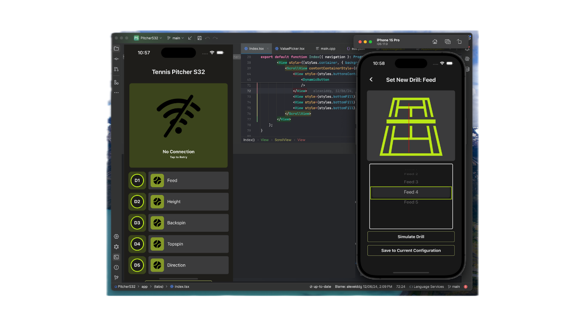

# Tennis Pitcher Control App

This project features a custom-built tennis pitcher designed and constructed by our team. The accompanying codebase includes a React Native app that allows users to control the tennis pitcher via Bluetooth Low Energy (BLE), communicating with a programmed ESP32 microprocessor. The system operates with 5 motors to control the feed, height, backspin, topspin, and direction of the tennis pitcher. Users can save configurations locally or execute them directly from their device for seamless and personalized training sessions.

## Key Features

- **Bluetooth Low Energy (BLE) Control**: Wirelessly manage the tennis pitcher using a React Native app.
- **ESP32 Microprocessor**: Programmed to handle communication and control of 5 motors.
- **Motor Functions**: Adjust feed, height, backspin, topspin, and direction for optimal training.
- **Local Storage**: Save and execute custom configurations directly from the user's device.

## Technologies Used

- **React Native**: Front-end mobile application development.
- **ESP32**: Microprocessor programming for motor control.
- **Bluetooth Low Energy (BLE)**: Wireless communication protocol.

## Usage

- **Connect to the Tennis Pitcher**: Open the app and connect to the tennis pitcher via Bluetooth.
- **Control Motors**: Adjust the feed, height, backspin, topspin, and direction using the app controls.
- **Save Configurations**: Save your custom configurations locally on your device.
- **Execute Configurations**: Directly execute saved configurations for your training sessions.

